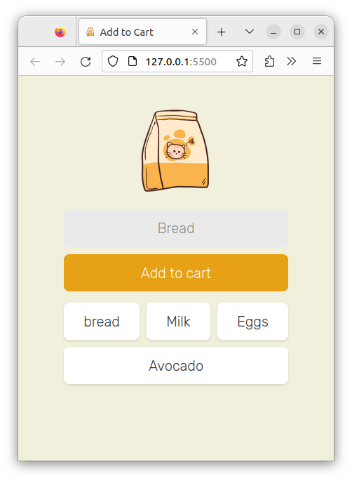

# Shopping Cart App

A simple web application for managing a shopping cart, built using HTML, CSS, and JavaScript with Firebase Realtime Database.

## Table of Contents
- [Features](#features)
- [Getting Started](#getting-started)
  - [Prerequisites](#prerequisites)
  - [Installation](#installation)
- [Usage](#usage)
- [Firebase Configuration](#firebase-configuration)
- [Contributing](#contributing)
- [License](#license)

## Features

- Add items to the shopping cart.
- View and manage the shopping cart in real-time.
- Firebase Realtime Database integration for data storage.

## Getting Started



### Prerequisites

Before you begin, ensure you have the following installed:

- Modern web browser
- Code editor (e.g., Visual Studio Code)

### Installation

1. Clone the repository:

    ```bash
    git clone https://github.com/AbhayPratap10/shopping-cart-app.git
    ```

2. Open the project in your code editor.

3. Open `index.html` in your web browser to see the application.

## Usage

1. Open `index.html` in a web browser.
2. Enter the item name in the input field and click "Add to cart."
3. View the shopping cart below, and double-click on an item to remove it.

## Firebase Configuration

This project uses Firebase Realtime Database. To configure your Firebase settings:

1. Create a Firebase project: [Firebase Console](https://console.firebase.google.com/).
2. Get your Firebase configuration object.
3. Replace the Firebase configuration in `index.js` with your own.

```javascript
// Replace this with your Firebase configuration
const firebaseConfig = {
  apiKey: "YOUR_API_KEY",
  authDomain: "YOUR_AUTH_DOMAIN",
  projectId: "YOUR_PROJECT_ID",
  storageBucket: "YOUR_STORAGE_BUCKET",
  messagingSenderId: "YOUR_MESSAGING_SENDER_ID",
  appId: "YOUR_APP_ID"
};
